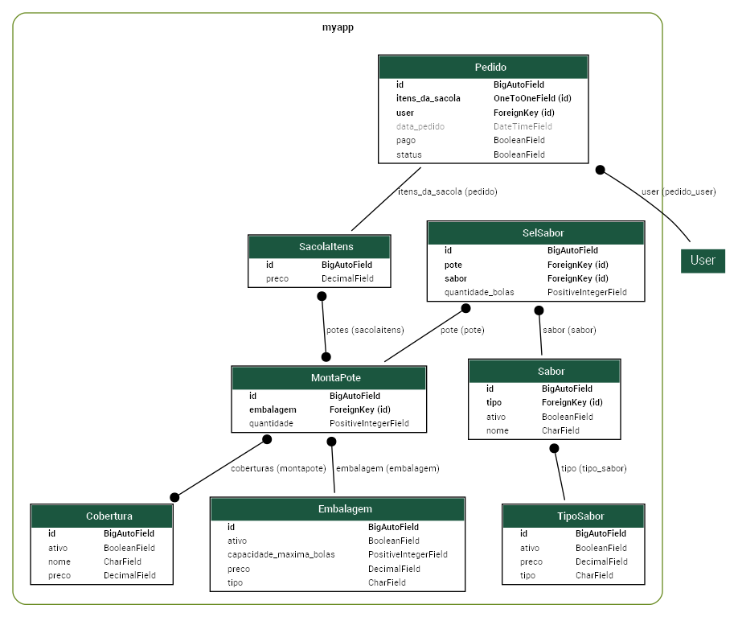

## Modelagem

Este diagrama serve para entender a estrutura do projeto.



Começaremos pelo **backend**, mostrando os modelos. Posteriormente, abordaremos o layout e outras configurações. Podemos usar o Django Admin para facilitar a simulação inicial.

### 1. Modelo **Embalagem**

A embalagem define o tamanho do sorvete, e seu preço deve corresponder à quantidade de bolas de sorvete que ela comporta.

**Exemplo:**
- 1L com 6 bolas
- 2L com 12 bolas
- 400mL com 4 bolas

```python
from django.db import models

class Embalagem(models.Model):
    tipo = models.CharField(max_length=50)
    capacidade_maxima_bolas = models.PositiveIntegerField()
    ativo = models.BooleanField()
    preco = models.DecimalField(max_digits=10, decimal_places=2)

    def preco_formatado(self):
        return f'R$ {self.preco:.2f}'

    def __str__(self):
        return f'{self.tipo} | PREÇO: R$ {self.preco:.2f}'

    class Meta:
        verbose_name = '1 - Embalagem'
        verbose_name_plural = '1 - Embalagem'
```

### 2. Modelo **TipoSabor**

Define o tipo do sabor (Tradicional, Premium, Sorbet, Açai), com preços diferenciados para cada tipo.

```python
class TipoSabor(models.Model):
    tipo = models.CharField(max_length=100)
    ativo = models.BooleanField()
    preco = models.DecimalField(max_digits=10, decimal_places=2)

    def preco_formatado(self):
        return f'R$ {self.preco:.2f}'

    def __str__(self):
        return f'{self.tipo} | PREÇO: R$ {self.preco:.2f}'

    class Meta:
        verbose_name = '2 - TipoSabor'
        verbose_name_plural = '2 - TipoSabor'
```

### 3. Modelo **Sabor**

Relaciona os sabores com o tipo de sabor. O preço é herdado da tabela **TipoSabor**.

```python
class Sabor(models.Model):
    nome = models.CharField(max_length=50)
    tipo = models.ForeignKey(TipoSabor, related_name='tipo_sabor', on_delete=models.CASCADE)
    ativo = models.BooleanField()

    def __str__(self):
        return f'{self.nome} | PREÇO: R$ {self.tipo.preco:.2f}'

    class Meta:
        verbose_name = '3 - Sabor'
        verbose_name_plural = '3 - Sabor'
```

### 4. Modelo **Cobertura**

As coberturas possuem um valor associado e são relacionadas ao pote de sorvete.

```python
class Cobertura(models.Model):
    nome = models.CharField(max_length=50)
    ativo = models.BooleanField()
    preco = models.DecimalField(max_digits=10, decimal_places=2)

    def preco_formatado(self):
        return f'R$ {self.preco:.2f}'

    def __str__(self):
        return f'{self.nome} | PREÇO: R$ {self.preco:.2f}'

    class Meta:
        verbose_name = '4 - Cobertura'
        verbose_name_plural = '4 - Cobertura'
```

### 5. Modelo **MontaPote**

Define a montagem do pote de sorvete, incluindo embalagem, sabores e coberturas.

```python
class MontaPote(models.Model):
    embalagem = models.ForeignKey(Embalagem, related_name='embalagem', on_delete=models.CASCADE, null=True)
    coberturas = models.ManyToManyField(Cobertura)
    quantidade = models.PositiveIntegerField(null=True)

    def __str__(self):
        return f"ID: {self.id} / POTE: {self.embalagem.tipo} / Qtd: {self.quantidade}"

    class Meta:
        verbose_name = 'B - MontaPote'
        verbose_name_plural = 'B - MontaPote'
```

### 6. Modelo **SelSabor**

Define a seleção de sabores para o pote, com a quantidade de bolas.

```python
class SelSabor(models.Model):
    pote = models.ForeignKey(MontaPote, related_name='pote', on_delete=models.CASCADE, null=True)
    sabor = models.ForeignKey(Sabor, related_name='sabor', on_delete=models.CASCADE, null=True)
    quantidade_bolas = models.PositiveIntegerField()

    def __str__(self):
        return f"Sabor: {self.sabor.nome}, Quantidade de Bolas: {self.quantidade_bolas}"

    class Meta:
        verbose_name = 'A - SelSabor'
        verbose_name_plural = 'A - SelSabor'
```

### 7. Modelo **SacolaItens**

Representa o "carrinho" do cliente, onde ele pode adicionar vários potes. Também registra o preço total do carrinho.

```python
class SacolaItens(models.Model):
    potes = models.ManyToManyField(MontaPote)
    preco = models.DecimalField(max_digits=10, decimal_places=2, null=True)

    def preco_formatado(self):
        return f'R$ {self.preco:.2f}'

    def __str__(self):
        return f"CARINHO: {self.id}"

    class Meta:
        verbose_name = 'C - SacolaItens'
        verbose_name_plural = 'C - SacolaItens'
```

### 8. Modelo **Pedido**

Registra os pedidos feitos pelos clientes, incluindo status de pagamento e o conteúdo do pedido.

```python
class Pedido(models.Model):
    data_pedido = models.DateTimeField(auto_now_add=True, null=True)
    user = models.ForeignKey(User, related_name='pedido_user', on_delete=models.PROTECT)
    itens_da_sacola = models.OneToOneField(SacolaItens, on_delete=models.CASCADE, null=True)
    status = models.BooleanField()
    pago = models.BooleanField()

    def __str__(self):
        return f"Pedido: {self.id} / {self.user} / (PAGO: {self.pago})"

    class Meta:
        verbose_name = 'D - Pedido'
        verbose_name_plural = 'D - Pedido'
```